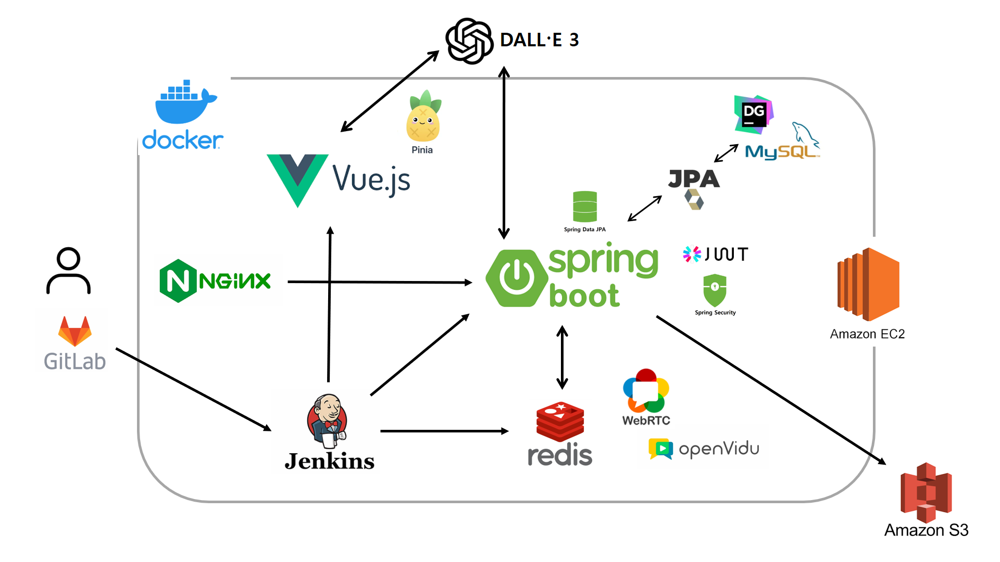
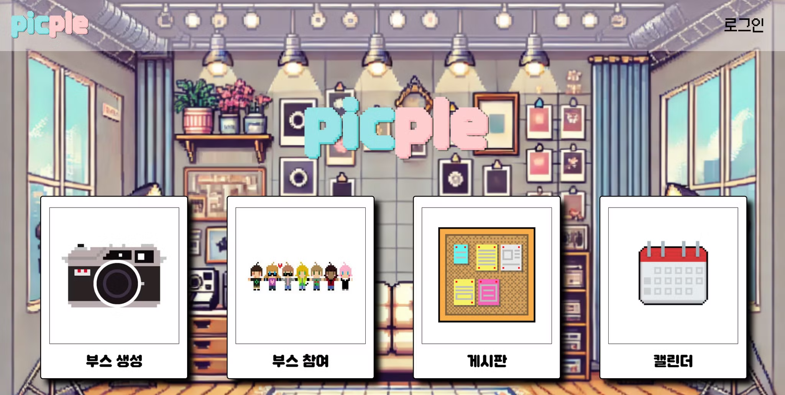
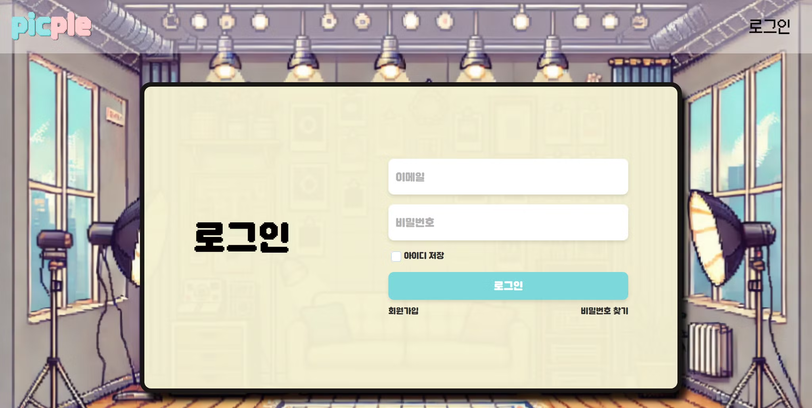
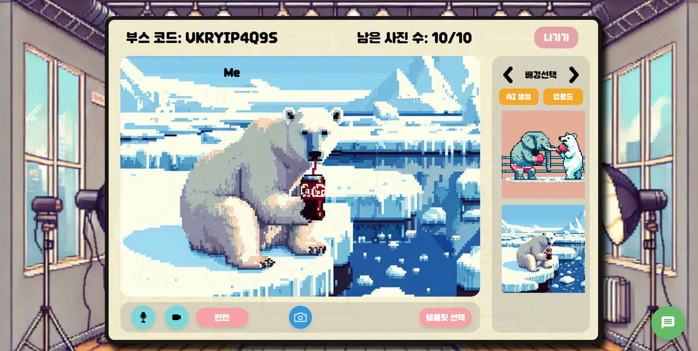
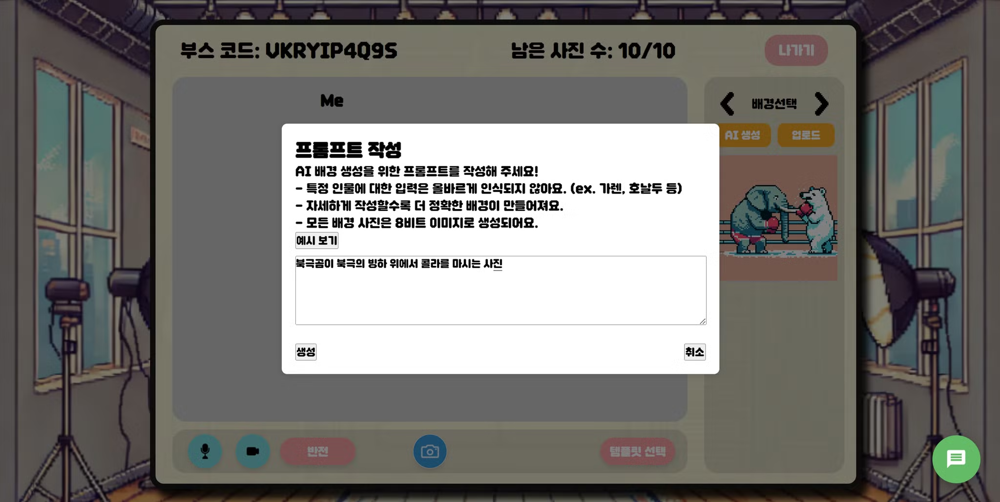
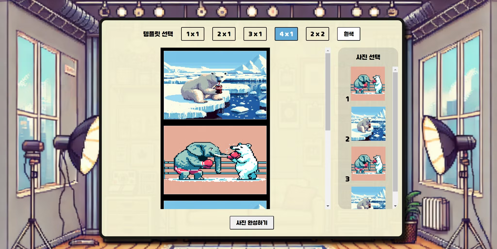
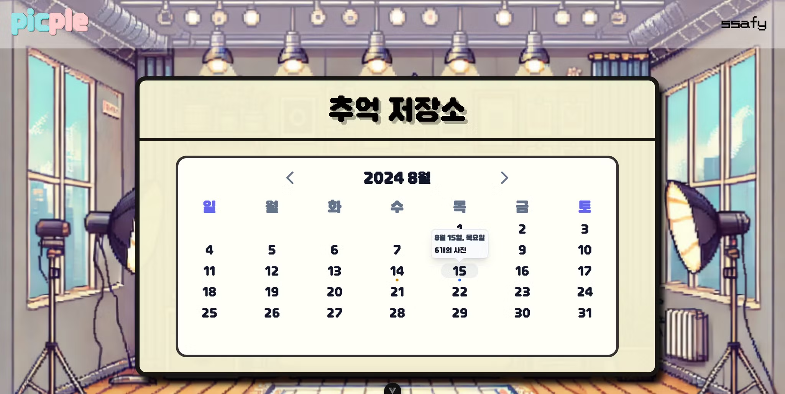
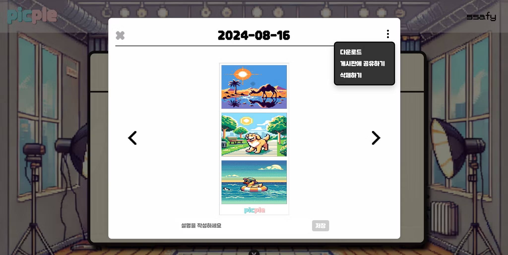
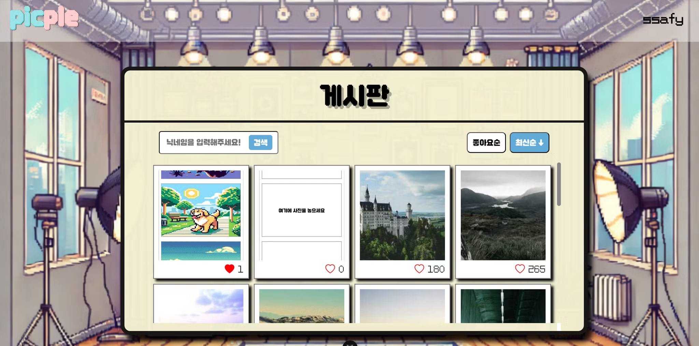

# 📷 PICPLE - 온라인 포토부스 서비스

> 2024.07.02 ~ 2024.08.16

## 📌 Introduction

1. [**웹 서비스 소개**](#-웹-서비스-소개)
2. [**기술 스택**](#-기술-스택)
3. [**주요 기능**](#-주요-기능)
4. [**시스템 아키텍쳐**](#-시스템-아키텍쳐)
5. [**서비스 화면**](#-서비스-화면)
6. [**팀원 소개**](#-팀원-소개)
7. [**문서**](#-문서)

## ✨ 웹 서비스 소개

### ✨ PICPLE: 거리를 넘어 함께 찍는 특별한 순간

멀리 있는 가족, 친구들과 함께 사진을 찍고 싶었지만 방법이 없어 아쉬웠던 적이 없으신가요?

온라인으로 연결은 됐지만, 실제로 함께 있는 것 같은 느낌으로 사진을 찍을 수 있는 서비스를 찾기 어려웠던 적이 없으신가요?

Picple만의 실시간 화상 연결을 통해 전 세계 어디에 있든 함께 사진을 찍고, 특별한 순간을 공유해보세요!

#### 🌟 PICPLE만의 특별함

     ⩥ 실시간 화상 연결: 거리에 상관없이 함께 있는 듯한 생생한 경험
     ⩥ 다양한 테마와 필터: 당신만의 독특하고 창의적인 사진 제작
     ⩥ 간편한 저장과 공유: 소중한 추억을 쉽게 간직하고 주변과 나눔

#### 💡 이런 분들에게 완벽해요

     ⩥ 해외 여행 중인 친구들과 인생샷을 남기고 싶은 분
     ⩥ 멀리 떨어진 가족들과 특별한 기념일을 함께 기록하고 싶은 분
     ⩥ SNS에 올릴 독특하고 재미있는 단체 사진을 원하는 분

## 🔨 기술 스택

<table>
    <tr>
        <td><b>Back-end</b></td>
        <td>
            
            
             
            
            
            
             
            
            
            
        </td>
    </tr>
    <tr>
        <td><b>Front-end</b></td>
        <td> 
            
            
            
            
             
            
            
            
             
            
            
            
            
             
        </td>
    </tr>
    <tr>
        <td><b>Infra</b></td>
        <td>     </td>
    <tr>
        <td><b>Tools</b></td>
        <td>
            
             
        </td>
    </tr>
</table>

## 💡 주요 기능

|             기능             | 내용                                                                                                                                                        |
| :--------------------------: | :---------------------------------------------------------------------------------------------------------------------------------------------------------- |
| **실시간 크로마키 포토부스** | 실시간 웹캠 화면에서 인물을 자동으로 크로마키 처리하여 촬영합니다. 사용자는 화면 속 인물을 자유롭게 드래그하여 크기 조절 및 위치 이동이 가능합니다.         |
|  **AI 배경 생성 및 커스텀**  | AI 기술을 활용해 다양한 배경을 생성하고 즉시 적용할 수 있습니다. 또는 사용자가 직접 로컬 이미지 파일을 업로드하여 원하는 배경으로 설정할 수 있습니다.       |
|  **추억 저장 및 공유 기능**  | 촬영한 사진은 개인 캘린더에 자동 저장되어 날짜별로 추억을 기록할 수 있습니다. 또한 커뮤니티 게시판을 통해 다른 사용자들과 특별한 순간을 공유할 수 있습니다. |

## 📊 시스템 아키텍쳐

## 서비스 화면

홈 화면  

로그인 화면  

부스 화면  

AI 배경 생성 화면  

사진 선택 화면  

캘린더 화면  

게시판 화면  

## 👨🏻‍💻 팀원 소개

|  |  |  |  |  |  |
| :----------------------------------------------------------------------------------------: | :-----------------------------------------------------------------------------------------: | :----------------------------------------------------------------------------------------: | :-----------------------------------------------------------------------------------------: | :-----------------------------------------------------------------------------------------: | :----------------------------------------------------------------------------------------: |
|            [김예훈 @gnsdp99](https://github.com/gnsdp99) `Main Frontend`            |           [김현재 @Kguswo](https://github.com/Kguswo) `Leader` / `Backend`           |       [박성훈 @seongddiyong](https://github.com/seongddiyong) `Main Backend`        |              [염규영 @gyuoo](https://github.com/gyuoo) `Backend` / `AI`              |          [옥진석 @JJOK97](https://github.com/JJOK97) `Frontend` / `WebRTC`           |           [유병주 @youbj](https://github.com/youbj) `Frontend` / `Infra`            |

## 📝 문서

### 1. [기능 명세서](https://thrilling-hickory-561.notion.site/2f908e6d3f4945fead2998969a572a51?pvs=4)

### 2. [와이어 프레임](https://www.figma.com/design/vZCRcTeV7l1uY29kUnykgc/PICPLE?node-id=0-1&t=XmfEvX8iE1Da69Hr-1)

### 3. [API 명세서](https://thrilling-hickory-561.notion.site/API-be69eb37997347619a71459698c03023?pvs=4)

### 4. [ERD](https://thrilling-hickory-561.notion.site/ERD-Diagram-a69e27fc5f9f45418beae19d41002f5c?pvs=4)
